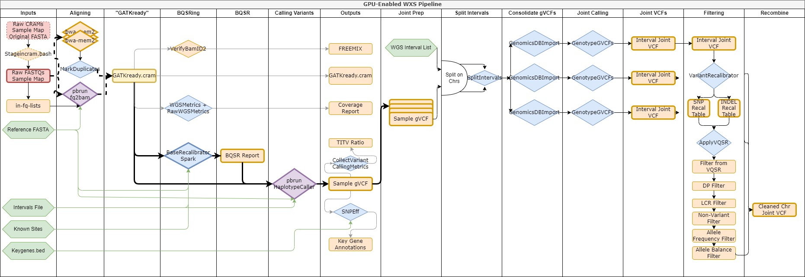
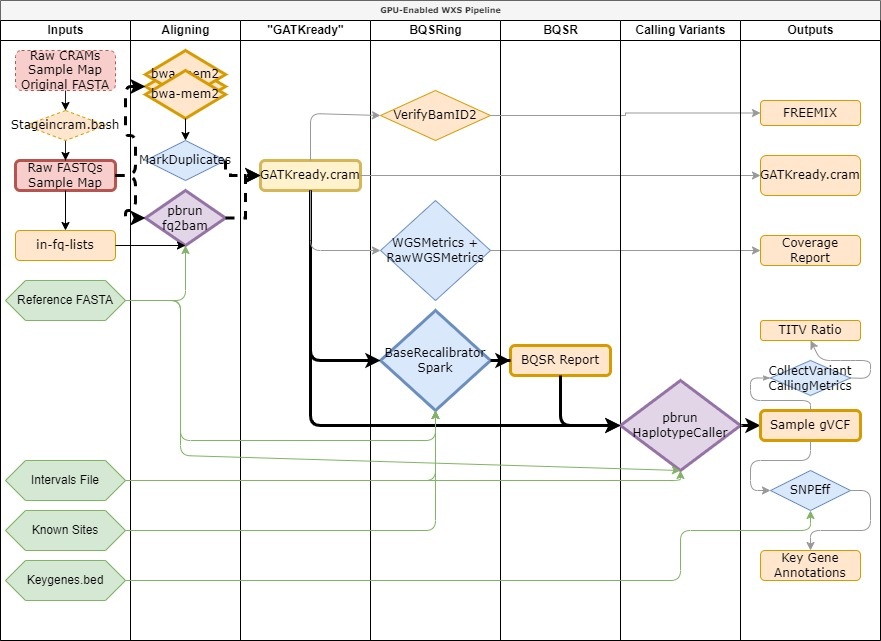

# NGI Center WXS-Pipelines
This repository is designed for processing whole genome and exome sequencing data on WUSTL's compute1 HPC cluster. The full processing pipeline from raw input data to project vcf can be seen below.

These pipelines follow the [GATK Best Practices for Germline Short Variant Discovery](https://gatk.broadinstitute.org/hc/en-us/articles/360035535932-Germline-short-variant-discovery-SNPs-Indels-).
## How to use this code
### Reference data
The references used within the pipeline are those from the [GATK Resource Bundle](https://gatk.broadinstitute.org/hc/en-us/articles/360035890811-Resource-bundle). Setting the resources to use is done by creating an env file like those in the baseEnvs directory and can be passed to jobs by changing the reference file in makeSampleEnv.bash.
### Software environment
The WXS pipelines were written for use on Washington University in St. Louis' compute1 HPC cluster. This system utilizes LSF for job submission and requires all code to be in a docker container. As such, the docker containers should be largely usable across systems and pipeline code can be used on other systems that use LSF, though the specifics may need to be changed based on what hardware is available. All docker container code can be found in the [docker](docker) folder.
### WGS Sample Pipeline
 The WGS sample pipeline can be run with the [wgspipeline.bash](wgspipeline.bash) script. This pipeline supports processing input files in fastq, bam, and cram formats without the need of specifying the input type. It produces:
- Aligned, sorted, duplicate-marked crams for each sample
- A gVCF for the sample
- Coverage reports
- VerifyBamID report
- Variant Calling Metrics

CPU and GPU infrastructures are utilized in the pipeline. Alignments first try GPUs, but then use CPUs if the GPU version failed or if GPUs aren’t available. The whole genome pipeline requires GPUs for variant calling using NVIDIA’s Clara Parabricks tool "haplotypecaller." This GPU requirement may limit its use in some circumstances. For the complete guide to running this pipeline, see [this guide](README-Compute1-MJ.docx).

### WGS Joint Calling Pipeline

The WGS joint calling pipeline can be run with the [wgsjointpipelinechr.bash](wgsjointpipelinechr.bash) script. This pipeline utilizes the gvcfs created from the sample pipeline and performs joint calling on the population by first importing them into genomicsDB datastores and then jointly calling with GenotypGVCFs. The pipeline runs per chromosome and utilizes the WGS interval list provided in the GATK Resource Bundle to perform joint calling on each interval and then merge the interval vcfs into chromosome vcfs.

The pipeline also performs allele-specific VQSR operations and some hard filtering. Filters include:
- VQSR
- Non-variants
- Depth
- LCR
- Allele fraction
- Allele balance

The QC has some hardcoded values that may require changing and also follows the [allele-specific](https://gatk.broadinstitute.org/hc/en-us/articles/360035890551-Allele-specific-annotation-and-filtering-of-germline-short-variants) paradigm. If you choose to make changes that don't use allele-specific annotations, the sample data produced by the WGS pipeline will still work.

### Server Code
There is code for WES processing in the [Hydra](Hydra) folder, named for the NGI Center's server. This code has few hardcoded values and can similarly be augmented to be used on your server.

### Wrapper Scripts
A host of wrapper scripts are available in the [wrappers](wrappers) folder. These include wrapper scripts for running the pipeline after a job failed at some point and also scripts for all of the QC reports that are made in the case that the pipeline succeeds. These wrapper scripts all utilize LSF-type job submission, so they may need to be changed to fit your system.
